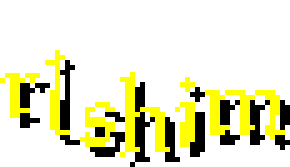

[](https://github.com/RdrSeraphim/rlshim/actions/workflows/ci.yml)
[](https://github.com/RdrSeraphim/rlshim/releases/latest)
[](https://build.opensuse.org/package/show/home:RdrSeraphim:rlshim/rlshim)


A lightweight, native shim for launching RuneLite on Linux with Jagex Accounts.

> Note: This is *relatively* stable software. It should Just Work™ but I cannot account for every use-case in my own testing. [Lemme know if it breaks.](https://github.com/RdrSeraphim/rlshim/issues)

## What it does

You might wish to view `rlshim` like a very simplified [Bolt](https://codeberg.org/Adamcake/Bolt). There's no RS3 support (nor do I plan on it), there's no custom launch command options (beyond passing flags to RuneLite), or custom RuneLite jar support (sorta, you can replace `~/.runelite/RuneLite.jar` with whatever you want). However, compared to Bolt, `rlshim` offers:
- A native launcher for RuneLite that doesn't depend on the Chromium Embedded Framework. `rlshim` (including assets) weighs <32mb compared to Bolt's ~318mb installation.<sup><a href="#fn-1">[1]</a></sup>
- A more secure handling of credentials by using `libsecret` (i.e. gnome-keyring, kwallet, keepassxc, pass-secret-service, etc.) to store Jagex Account credentials encrypted and using syscalls to prevent process memory from leaking creds when it gets pulled out of storage. No plaintext local file storage here.
- A non-obtrusive flow. The only time you'll see an interface is if it's your first time logging in, or you have to select a character (since Jagex Accounts support up to 20 linked).

When `rlshim` is installed, a desktop entry for RuneLite gets made. Running it runs `rlshim`, handling credentials and ensures RuneLite is available and Java exists to run it, then runs it. That's it.

<span id="fn-1">
<small>[1] Combining <code>du -h rlshim</code> (in Release build) and <code>du -h ./data</code>, comparing to <code>du -h ~/.local/share/flatpak/app/com.adamcake.Bolt/current/active/files/opt/bolt-launcher/</code>, and that's not accounting for Flatpak-specific extras.</small>
</span>

## Installation

Where possible, rlshim supports x86_64 and aarch64 on glibc and/or musl based environments. For glibc-based environments (most of you), read below to find instructions for your distro. For musl-based environments, you'll need to use our [binary `.tar.gz` releases](https://github.com/RdrSeraphim/rlshim/releases/latest) -- I assume you know what you're doing.

⚠️ **WARNING: `rlshim` does not have Java as a dependency in any of its packages, since it's a RuneLite dependency (properly speaking). Make sure you have Java 11+ installed and `java` is available on your `$PATH`.**

If your distro isn't here and you're willing to provide a mechanism to make packages for it, feel free to make a pull request.

### Flatpak (Any Distro)
Pre-built `.flatpak` bundles are available on the [Releases](https://github.com/RdrSeraphim/rlshim/releases) page. Download the appropriate architecture for your system and install it:
```bash
flatpak install ./life.srp.rlshim-*.flatpak
```

### deb-based distros (Debian, Ubuntu, Mint, etc.)
Check the [Releases](https://github.com/RdrSeraphim/rlshim/releases) page for pre-compiled `.deb` packages. Download the latest version and install it via:
```bash
sudo apt install ./rlshim-*.deb
```

### Arch Linux (AUR)
Well, once the [supply chain attack](https://archlinux.org/news/active-aur-malicious-packages-incident/) stops and I can register an account. In the meantime, you can fetch the PKGBUILDs (zipped as `aur_pkgbuilds.zip`) from the [Releases page](https://github.com/RdrSeraphim/rlshim/releases) and build it yourself with `makepkg -si`.

For the stable binary release:  
```bash
yay -S rlshim-bin
```

For the stable source release:
```bash
yay -S rlshim
```

For the "nightly" source release:  
```bash
yay -S rlshim-git
```

### Fedora (rpm-based)
Packages are built and [hosted on COPR](https://copr.fedorainfracloud.org/coprs/srp/rlshim/). You can install `rlshim` by adding the COPR repo and installing the package:

```bash
sudo dnf copr enable srp/rlshim
sudo dnf install rlshim
```

### openSUSE (15.6, 16.0, Slowroll, Tumbleweed)
You can use the OBS Package Installer (`opi`) to install the package from the openSUSE Build Service:

```bash
sudo zypper in opi
opi rlshim
```

If you prefer using repos, you can install it with:

```bash
sudo zypper ar https://download.opensuse.org/repositories/home:/RdrSeraphim:/rlshim/$(lsb_release -d | sed 's/.* //')/home:RdrSeraphim:rlshim.repo
sudo zypper in rlshim
```

### Nix / NixOS (Flakes)
Add the repo to your flake.nix inputs:
```nix
rlshim = { url = "github:RdrSeraphim/rlshim"; inputs.nixpkgs.follows = "nixpkgs"; };
```

Then add it to a package list somewhere:
```nix
environment.systemPackages = [
  inputs.rlshim.packages.${system}.default
];
```

## Building

### 1. Install Dependencies
You will need a modern C++ compiler (supporting C++23), CMake, and a few development headers for the GUI and Keyring. Depending on your Linux distribution, install the following packages:

**Debian / Ubuntu:**
```bash
sudo apt install clang build-essential cmake pkg-config libsecret-1-dev libssl-dev libglfw3-dev libgl1-mesa-dev libcurl4-openssl-dev libx11-dev libxcursor-dev libxi-dev libxinerama-dev libxrandr-dev
```

**Fedora / RHEL:**
```bash
sudo dnf install clang @development-tools cmake pkgconf libsecret-devel openssl-devel glfw-devel mesa-libGL-devel libcurl-devel libX11-devel libXcursor-devel libXi-devel libXinerama-devel libXrandr-devel git
```

**Arch Linux:**
```bash
sudo pacman -S clang base-devel cmake pkgconf libsecret openssl curl libx11 libxcursor libxi libxinerama libxrandr git glfw-wayland # (or glfw-x11)
```

### 2. Compile

There's a convenient Makefile wrapper to streamline building:

```bash
# Build the optimized release version (default)
make

# Build the debug version (with debugging symbols)
make debug

# Build release packages (.deb, .rpm, .tar.gz)
make package

# Build debug packages (.deb, .rpm, .tar.gz)
make debug-package

# Install to system directories (installs bin, desktop entries, and assets)
sudo make install

# Uninstall from system directories (removes bin, desktop entries, and assets)
sudo make uninstall

# Clean the build directory
make clean
```

## Usage & Flags

You can launch `rlshim` in your terminal or via your application launcher with the RuneLite desktop entry. 

### Built-in Flags

`rlshim` intercepts a few specific flags for its own configuration:

- `--no-gui`: Disables using any GUI. If you have multiple characters linked to your Jagex Account or it's your first time running `rlshim`, it will fall back to a terminal-based text prompt.
- `--logout`: Safely deletes your saved Jagex Account credentials from your system keyring (`libsecret`). The program will exit, and the next time you launch `rlshim`, you will be prompted to log in interactively again.

### Forwarded Flags

**Any other flags** passed to `rlshim` are safely ignored by the shim and passed directly through to `runelite.jar`.

For example, running:
```bash
rlshim --no-gui --mode=safe --developer-mode
```
Will cause `rlshim` to use the CLI prompts where relevant (`--no-gui`), and then launch RuneLite with the remaining `--mode=safe --developer-mode` arguments.

### Credits
GUI background image from Jagex. Inform me if there's a more ethical way of sourcing it.

Some fonts and the RuneLite icon are sourced from [RuneLite's repo](https://github.com/runelite/runelite).
```
BSD 2-Clause License

Copyright (c) 2016-2017, Adam <Adam@sigterm.info>
All rights reserved.

Redistribution and use in source and binary forms, with or without
modification, are permitted provided that the following conditions are met:

* Redistributions of source code must retain the above copyright notice, this
  list of conditions and the following disclaimer.

* Redistributions in binary form must reproduce the above copyright notice,
  this list of conditions and the following disclaimer in the documentation
  and/or other materials provided with the distribution.

THIS SOFTWARE IS PROVIDED BY THE COPYRIGHT HOLDERS AND CONTRIBUTORS "AS IS"
AND ANY EXPRESS OR IMPLIED WARRANTIES, INCLUDING, BUT NOT LIMITED TO, THE
IMPLIED WARRANTIES OF MERCHANTABILITY AND FITNESS FOR A PARTICULAR PURPOSE ARE
DISCLAIMED. IN NO EVENT SHALL THE COPYRIGHT HOLDER OR CONTRIBUTORS BE LIABLE
FOR ANY DIRECT, INDIRECT, INCIDENTAL, SPECIAL, EXEMPLARY, OR CONSEQUENTIAL
DAMAGES (INCLUDING, BUT NOT LIMITED TO, PROCUREMENT OF SUBSTITUTE GOODS OR
SERVICES; LOSS OF USE, DATA, OR PROFITS; OR BUSINESS INTERRUPTION) HOWEVER
CAUSED AND ON ANY THEORY OF LIABILITY, WHETHER IN CONTRACT, STRICT LIABILITY,
OR TORT (INCLUDING NEGLIGENCE OR OTHERWISE) ARISING IN ANY WAY OUT OF THE USE
OF THIS SOFTWARE, EVEN IF ADVISED OF THE POSSIBILITY OF SUCH DAMAGE.
```

Some fonts also sourced from [RuneStar's repo](https://github.com/RuneStar/fonts).
